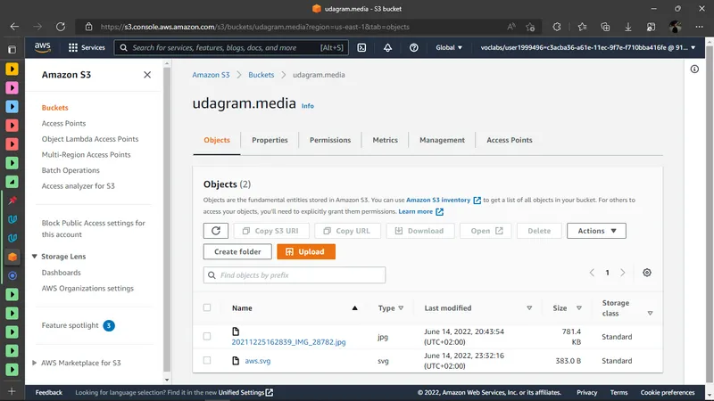
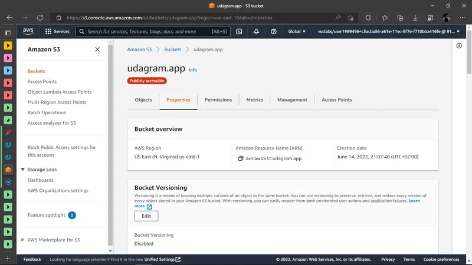

# Hosting a Full-Stack Application

That repo is for FWD's deployment's task. Here is the starter project [udacity/nd0067-c4-deployment-process-project-starter](https://github.com/udacity/nd0067-c4-deployment-process-project-starter).

---

## Live app

<http://udagram.app.s3-website-us-east-1.amazonaws.com>.

---

## Screen shots

### **AWS Configurations**

#### **S3 buckets**

Media bucket

Frontend app bucket

#### **Elastic Beanstalk**

#### **RDS**

### **CircleCI**

#### **Environment Variables**

#### **Passing SS**

---

## Dependencies

- [Angular](https://angular.io/) - Single Page Application Framework
- [Node](https://nodejs.org) - Javascript Runtime
- [Express](https://expressjs.com/) - Javascript API Framework

---

## License

[LICENSE](/LICENSE.txt)
